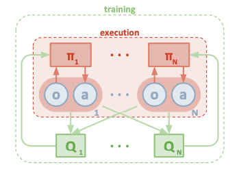
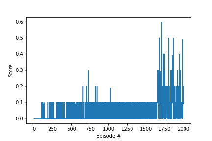
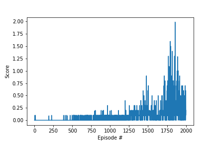
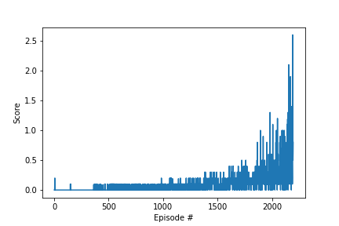

# REPORT

The algorithm chosen to solve this environment is MADDPG. As starting point Udacity's code for DDPG was used. The code base needed quite a few changes to accomodate MADDPG. In MADDPG the critic has full few of the state and actions in the environment. The actors only have visibility of their own states.

**MADDPG block diagram:**



The critic and actor neural network are each 3 layers with first hidden layer at 400 units and second hidden layer at 300 units. For the actor the tanh activation is used, since the output needs to be in range -1 to +1. Some noise is added for exploration. The noise process used is Ohrnstein Uhlenbeck. The critic output has no activation function.

```
Actor(
  (fc1): Linear(in_features=24, out_features=400, bias=True)
  (bn1): BatchNorm1d(400, eps=1e-05, momentum=0.1, affine=True, track_running_stats=True)
  (fc2): Linear(in_features=400, out_features=300, bias=True)
  (fc3): Linear(in_features=300, out_features=2, bias=True)
)
Critic(
  (fcs1): Linear(in_features=48, out_features=400, bias=True)
  (bn1): BatchNorm1d(400, eps=1e-05, momentum=0.1, affine=True, track_running_stats=True)
  (fc2): Linear(in_features=404, out_features=300, bias=True)
  (fc3): Linear(in_features=300, out_features=1, bias=True)
)
```

## Attempt 1

In this 1st attempt the action of the other agent was fed into the input layer of the critic. The replay buffer size was chosen at 128. Each agent has its own replay buffer.

The score reached 0.5 for a brief peak, but not on average.




## Attempt 2

The learning rate was slight increased to 5-e4 and the replay buffer size was increased to 256. The environment might have been solved. However, the number of episodes was set to 2000.




## Attempt 3 and Solution

The actions of the other agent are now fed into the 2nd layer of the critic along with own actions. Number of max episodes was increased to 10,000 to give enough time for learning.



You can find a screen recording of the agents playing tennis in `Tennis.mov`.

Hyper-parameters of solution:

| Parameter | Setting |
| --- | --- |
|BUFFER_SIZE | int(1e5)|
|BATCH_SIZE | 256|
|GAMMA | 0.99 |
|TAU | 1e-3 |
|LR_ACTOR | 5e-4 |
|LR_CRITIC | 1e-3  |
|WEIGHT_DECAY | 0 |
|MU | 0.0 | 
|THETA | 0.15 |
|SIGMA | 0.2 |


## Ideas for Improvements

Instead of using seperate experience replay buffers the agents could share the experience buffer, as suggested in Udacity hints to solve this problem.

To speed up learning PER, Prioritized Experience Replay, could be tried. PER places more importance on experiences with high impact on training. Those are experiences that produce results that diverge the most from the expected result.