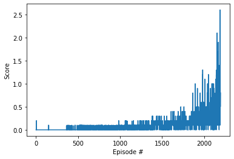

```python
import sys, os
sys.path.append(os.getcwd())
print(sys.path)
```

    ['/Users/chrisg/miniconda3/envs/drlnd/lib/python36.zip', '/Users/chrisg/miniconda3/envs/drlnd/lib/python3.6', '/Users/chrisg/miniconda3/envs/drlnd/lib/python3.6/lib-dynload', '', '/Users/chrisg/miniconda3/envs/drlnd/lib/python3.6/site-packages', '/Users/chrisg/miniconda3/envs/drlnd/lib/python3.6/site-packages/IPython/extensions', '/Users/chrisg/.ipython', '/Users/chrisg/dev/deep-reinforcement-multiagent']


```python
from unityagents import UnityEnvironment
import numpy as np
```


```python
env = UnityEnvironment(file_name="Tennis.app", no_graphics=True)
```

    INFO:unityagents:
    'Academy' started successfully!
    Unity Academy name: Academy
            Number of Brains: 1
            Number of External Brains : 1
            Lesson number : 0
            Reset Parameters :
    		
    Unity brain name: TennisBrain
            Number of Visual Observations (per agent): 0
            Vector Observation space type: continuous
            Vector Observation space size (per agent): 8
            Number of stacked Vector Observation: 3
            Vector Action space type: continuous
            Vector Action space size (per agent): 2
            Vector Action descriptions: , 


Environments contain **_brains_** which are responsible for deciding the actions of their associated agents. Here we check for the first brain available, and set it as the default brain we will be controlling from Python.


```python
# get the default brain
brain_name = env.brain_names[0]
brain = env.brains[brain_name]
brain_name
```


    'TennisBrain'


```python
# reset the environment
env_info = env.reset(train_mode=True)[brain_name]

# number of agents 
num_agents = len(env_info.agents)
print('Number of agents:', num_agents)

# size of each action
action_size = brain.vector_action_space_size
print('Size of each action:', action_size)

# examine the state space 
states = env_info.vector_observations
state_size = states.shape[1]
print('There are {} agents. Each observes a state with length: {}'.format(states.shape[0], state_size))
print('The state for the first agent looks like:', states[0])
```

    Number of agents: 2
    Size of each action: 2
    There are 2 agents. Each observes a state with length: 24
    The state for the first agent looks like: [ 0.          0.          0.          0.          0.          0.
      0.          0.          0.          0.          0.          0.
      0.          0.          0.          0.         -6.65278625 -1.5
     -0.          0.          6.83172083  6.         -0.          0.        ]


```python
### Random Actions

for i in range(1, 2):                                      # play game for 5 episodes
    env_info = env.reset(train_mode=False)[brain_name]     # reset the environment    
    states = env_info.vector_observations                  # get the current state (for each agent)
    scores = np.zeros(num_agents)                          # initialize the score (for each agent)
    while True:
        actions = np.random.randn(num_agents, action_size) # select an action (for each agent)
        print('actions', actions)
        actions = np.clip(actions, -1, 1)                  # all actions between -1 and 1
        #print(actions)
        env_info = env.step(actions)[brain_name]           # send all actions to tne environment
        next_states = env_info.vector_observations         # get next state (for each agent)
        print('next_states', next_states)
        rewards = env_info.rewards                         # get reward (for each agent)
        print('rewards', rewards)
        dones = env_info.local_done                        # see if episode finished
        print('dones', dones)
        scores += env_info.rewards                         # update the score (for each agent)
        print('scores', scores)
        states = next_states                               # roll over states to next time step
        #if np.any(dones):                                  # exit loop if episode finished
        if True:
            break
    print('Score (max over agents) from episode {}: {}'.format(i, np.max(scores)))

```

    actions [[ 1.73822026 -0.25101022]
     [-0.95900332 -1.41671735]]
    next_states [[  0.           0.           0.           0.           0.
        0.           0.           0.          -7.38993645  -1.5
       -0.           0.           6.83172083   5.99607611  -0.
        0.          -4.38993692  -1.55886006  30.          -0.98100001
        6.83172083   5.91759634  30.          -0.98100001]
     [  0.           0.           0.           0.           0.
        0.           0.           0.          -6.70024681  -1.5
        0.           0.          -6.83172083   5.99607611   0.
        0.          -9.57725811  -1.55886006 -28.77009964  -0.98100001
       -6.83172083   5.91759634 -28.77009964  -0.98100001]]
    rewards [0.0, 0.0]
    dones [False, False]
    scores [0. 0.]
    Score (max over agents) from episode 1: 0.0


```python
from ddpg_agent import Agent

agent = Agent(state_size, action_size, 11, 99)
```


```python
from collections import deque
import matplotlib.pyplot as plt
import torch
from timeit import default_timer as timer

# DEFAULTS:
# n_episodes = 10000
# max_t = 1000
# print_every = 10
# target_window = 100
# target_score = 0.5
def run(n_episodes=10000, max_t=1000, print_every=10, target_window=100, target_score=0.5):
    scores_deque = deque(maxlen=target_window)
    scores_total = []
    train_every = 20
    train_iterations = 15
    time_deque = deque(maxlen=print_every)
    
    for i_episode in range(1, n_episodes+1):
        
        env_info = env.reset(train_mode=True)[brain_name]
        states = env_info.vector_observations
        scores = np.zeros(num_agents)
        agent.reset()
         
        start = timer()
        t_done = 0
        for t in range(max_t):
            
            # actions between -1,1 calls for tanh
            #print(states)
            actions = agent.act(states, t).cpu().detach().numpy()
            #print(actions)
            env_info = env.step(actions)[brain_name]
            next_states = env_info.vector_observations
            #print(next_states)
            rewards = env_info.rewards
            #print(rewards)
            dones = env_info.local_done
            #print(dones)
            
            train = not bool(t % train_every)
            
            agent.step(states, actions, rewards, next_states, dones, train, train_iterations)  
            
            states = next_states
            scores += rewards
            #print('r',rewards)
            #print('s',scores)
            if np.any(dones):
                t_done = t
                #print('done at', t_done)
                break
                
        end = timer()
        delta = end - start
        time_deque.append(delta)
        scores_max = np.max(scores)
        scores_deque.append(scores_max)
        scores_total.append(scores_max)
        scores_deque_mean = np.mean(scores_deque)
        print('\rEpisode {} t{}\tAverage Score: {:.4f}\t({:.0f} sec)'.format(i_episode, t_done, scores_deque_mean, delta), end="")
      
        #print(np.max(scores_deque))
        if i_episode % print_every == 0:
            #print(np.max(scores_deque))
            scores_deque_max = np.max(scores_deque)
            torch.save(agent.actor_local_0.state_dict(), 'checkpoint_actor_local_0.pth')
            torch.save(agent.actor_local_1.state_dict(), 'checkpoint_actor_local_1.pth')               
            print('\rEpisode {}\tAverage Score: {:.4f}\tMax: {:.4f}\t({:.0f} sec avrg)'\
                  .format(i_episode, scores_deque_mean, scores_deque_max, np.mean(time_deque)))
        sma_bool = [s >= target_score for s in scores_deque]
        #print(scores_deque)
        #if np.all(sma_bool) and len(sma_bool) >= target_window: 
        if scores_deque_mean >= target_score and len(scores_deque) >= target_window:
            print("\n*** Environment Solved ***")
            torch.save(agent.actor_local_0.state_dict(), 'env_actor_local_0.pth')
            torch.save(agent.actor_local_1.state_dict(), 'env_actor_local_1.pth')          
            break
                
            
    return scores_total, scores_deque

scores, sma = run()
print([ int(s*1000)/1000.0 for s in sma])
#print(scores)
fig = plt.figure()
ax = fig.add_subplot(111)
plt.plot(np.arange(1, len(scores)+1), scores)
plt.ylabel('Score')
plt.xlabel('Episode #')
plt.savefig('scores.png')            
```

    Episode 10	Average Score: 0.0290	Max: 0.2000	(0 sec avrg)
    Episode 20	Average Score: 0.0145	Max: 0.2000	(1 sec avrg)
    Episode 30	Average Score: 0.0097	Max: 0.2000	(1 sec avrg)
    Episode 40	Average Score: 0.0073	Max: 0.2000	(1 sec avrg)
    Episode 50	Average Score: 0.0058	Max: 0.2000	(1 sec avrg)
    Episode 60	Average Score: 0.0048	Max: 0.2000	(1 sec avrg)
    Episode 70	Average Score: 0.0041	Max: 0.2000	(2 sec avrg)
    Episode 80	Average Score: 0.0036	Max: 0.2000	(1 sec avrg)
    Episode 90	Average Score: 0.0032	Max: 0.2000	(1 sec avrg)
    Episode 100	Average Score: 0.0029	Max: 0.2000	(1 sec avrg)
    Episode 110	Average Score: 0.0000	Max: 0.0000	(2 sec avrg)
    Episode 120	Average Score: 0.0000	Max: 0.0000	(2 sec avrg)
    Episode 130	Average Score: 0.0000	Max: 0.0000	(1 sec avrg)
    Episode 140	Average Score: 0.0000	Max: 0.0000	(2 sec avrg)
    Episode 150	Average Score: 0.0010	Max: 0.1000	(2 sec avrg)
    Episode 160	Average Score: 0.0020	Max: 0.1000	(2 sec avrg)
    Episode 170	Average Score: 0.0020	Max: 0.1000	(1 sec avrg)
    Episode 180	Average Score: 0.0020	Max: 0.1000	(1 sec avrg)
    Episode 190	Average Score: 0.0020	Max: 0.1000	(1 sec avrg)
    Episode 200	Average Score: 0.0020	Max: 0.1000	(2 sec avrg)
    Episode 210	Average Score: 0.0020	Max: 0.1000	(2 sec avrg)
    Episode 220	Average Score: 0.0020	Max: 0.1000	(1 sec avrg)
    Episode 230	Average Score: 0.0020	Max: 0.1000	(1 sec avrg)
    Episode 240	Average Score: 0.0020	Max: 0.1000	(2 sec avrg)
    Episode 250	Average Score: 0.0010	Max: 0.1000	(1 sec avrg)
    Episode 260	Average Score: 0.0000	Max: 0.0000	(1 sec avrg)
    Episode 270	Average Score: 0.0000	Max: 0.0000	(2 sec avrg)
    Episode 280	Average Score: 0.0000	Max: 0.0000	(2 sec avrg)
    Episode 290	Average Score: 0.0000	Max: 0.0000	(2 sec avrg)
    Episode 300	Average Score: 0.0000	Max: 0.0000	(2 sec avrg)
    Episode 310	Average Score: 0.0000	Max: 0.0000	(1 sec avrg)
    Episode 320	Average Score: 0.0000	Max: 0.0000	(2 sec avrg)
    Episode 330	Average Score: 0.0000	Max: 0.0000	(2 sec avrg)
    Episode 340	Average Score: 0.0000	Max: 0.0000	(2 sec avrg)
    Episode 350	Average Score: 0.0000	Max: 0.0000	(2 sec avrg)
    Episode 360	Average Score: 0.0000	Max: 0.0000	(2 sec avrg)
    Episode 370	Average Score: 0.0019	Max: 0.1000	(2 sec avrg)
    Episode 380	Average Score: 0.0029	Max: 0.1000	(2 sec avrg)
    Episode 390	Average Score: 0.0039	Max: 0.1000	(2 sec avrg)
    Episode 400	Average Score: 0.0058	Max: 0.1000	(2 sec avrg)
    Episode 410	Average Score: 0.0076	Max: 0.1000	(2 sec avrg)
    Episode 420	Average Score: 0.0103	Max: 0.1000	(2 sec avrg)
    Episode 430	Average Score: 0.0131	Max: 0.1000	(2 sec avrg)
    Episode 440	Average Score: 0.0140	Max: 0.1000	(2 sec avrg)
    Episode 450	Average Score: 0.0149	Max: 0.1000	(2 sec avrg)
    Episode 460	Average Score: 0.0149	Max: 0.1000	(2 sec avrg)
    Episode 470	Average Score: 0.0159	Max: 0.1000	(2 sec avrg)
    Episode 480	Average Score: 0.0149	Max: 0.1000	(2 sec avrg)
    Episode 490	Average Score: 0.0149	Max: 0.1000	(2 sec avrg)
    Episode 500	Average Score: 0.0139	Max: 0.1000	(2 sec avrg)
    Episode 510	Average Score: 0.0139	Max: 0.1000	(2 sec avrg)
    Episode 520	Average Score: 0.0171	Max: 0.1000	(2 sec avrg)
    Episode 530	Average Score: 0.0192	Max: 0.1000	(2 sec avrg)
    Episode 540	Average Score: 0.0242	Max: 0.1000	(2 sec avrg)
    Episode 550	Average Score: 0.0292	Max: 0.1000	(2 sec avrg)
    Episode 560	Average Score: 0.0340	Max: 0.1000	(2 sec avrg)
    Episode 570	Average Score: 0.0349	Max: 0.1000	(2 sec avrg)
    Episode 580	Average Score: 0.0368	Max: 0.1000	(2 sec avrg)
    Episode 590	Average Score: 0.0387	Max: 0.1000	(2 sec avrg)
    Episode 600	Average Score: 0.0396	Max: 0.1000	(2 sec avrg)
    Episode 610	Average Score: 0.0407	Max: 0.1000	(2 sec avrg)
    Episode 620	Average Score: 0.0386	Max: 0.1000	(2 sec avrg)
    Episode 630	Average Score: 0.0355	Max: 0.1000	(2 sec avrg)
    Episode 640	Average Score: 0.0306	Max: 0.1000	(2 sec avrg)
    Episode 650	Average Score: 0.0267	Max: 0.1000	(2 sec avrg)
    Episode 660	Average Score: 0.0239	Max: 0.1000	(2 sec avrg)
    Episode 670	Average Score: 0.0211	Max: 0.1000	(2 sec avrg)
    Episode 680	Average Score: 0.0219	Max: 0.1000	(2 sec avrg)
    Episode 690	Average Score: 0.0200	Max: 0.1000	(2 sec avrg)
    Episode 700	Average Score: 0.0192	Max: 0.1000	(2 sec avrg)
    Episode 710	Average Score: 0.0181	Max: 0.1000	(2 sec avrg)
    Episode 720	Average Score: 0.0162	Max: 0.1000	(2 sec avrg)
    Episode 730	Average Score: 0.0164	Max: 0.1000	(2 sec avrg)
    Episode 740	Average Score: 0.0174	Max: 0.1000	(2 sec avrg)
    Episode 750	Average Score: 0.0194	Max: 0.1000	(3 sec avrg)
    Episode 760	Average Score: 0.0202	Max: 0.1000	(2 sec avrg)
    Episode 770	Average Score: 0.0222	Max: 0.1000	(2 sec avrg)
    Episode 780	Average Score: 0.0245	Max: 0.1000	(2 sec avrg)
    Episode 790	Average Score: 0.0284	Max: 0.1000	(3 sec avrg)
    Episode 800	Average Score: 0.0303	Max: 0.1000	(2 sec avrg)
    Episode 810	Average Score: 0.0285	Max: 0.1000	(2 sec avrg)
    Episode 820	Average Score: 0.0294	Max: 0.1000	(2 sec avrg)
    Episode 830	Average Score: 0.0284	Max: 0.1000	(2 sec avrg)
    Episode 840	Average Score: 0.0302	Max: 0.1000	(2 sec avrg)
    Episode 850	Average Score: 0.0271	Max: 0.1000	(2 sec avrg)
    Episode 860	Average Score: 0.0281	Max: 0.1000	(2 sec avrg)
    Episode 870	Average Score: 0.0298	Max: 0.1000	(3 sec avrg)
    Episode 880	Average Score: 0.0266	Max: 0.1000	(2 sec avrg)
    Episode 890	Average Score: 0.0253	Max: 0.1000	(2 sec avrg)
    Episode 900	Average Score: 0.0261	Max: 0.1000	(2 sec avrg)
    Episode 910	Average Score: 0.0316	Max: 0.1000	(3 sec avrg)
    Episode 920	Average Score: 0.0343	Max: 0.1000	(3 sec avrg)
    Episode 930	Average Score: 0.0370	Max: 0.1000	(2 sec avrg)
    Episode 940	Average Score: 0.0359	Max: 0.1000	(2 sec avrg)
    Episode 950	Average Score: 0.0386	Max: 0.1000	(2 sec avrg)
    Episode 960	Average Score: 0.0413	Max: 0.1000	(3 sec avrg)
    Episode 970	Average Score: 0.0415	Max: 0.1000	(3 sec avrg)
    Episode 980	Average Score: 0.0435	Max: 0.1000	(2 sec avrg)
    Episode 990	Average Score: 0.0485	Max: 0.2000	(3 sec avrg)
    Episode 1000	Average Score: 0.0507	Max: 0.2000	(3 sec avrg)
    Episode 1010	Average Score: 0.0501	Max: 0.2000	(2 sec avrg)
    Episode 1020	Average Score: 0.0524	Max: 0.2000	(3 sec avrg)
    Episode 1030	Average Score: 0.0555	Max: 0.2000	(3 sec avrg)
    Episode 1040	Average Score: 0.0537	Max: 0.2000	(2 sec avrg)
    Episode 1050	Average Score: 0.0539	Max: 0.2000	(2 sec avrg)
    Episode 1060	Average Score: 0.0523	Max: 0.2000	(3 sec avrg)
    Episode 1070	Average Score: 0.0582	Max: 0.2000	(4 sec avrg)
    Episode 1080	Average Score: 0.0664	Max: 0.2000	(5 sec avrg)
    Episode 1090	Average Score: 0.0646	Max: 0.2000	(3 sec avrg)
    Episode 1100	Average Score: 0.0647	Max: 0.2000	(3 sec avrg)
    Episode 1110	Average Score: 0.0647	Max: 0.2000	(3 sec avrg)
    Episode 1120	Average Score: 0.0637	Max: 0.2000	(3 sec avrg)
    Episode 1130	Average Score: 0.0627	Max: 0.2000	(3 sec avrg)
    Episode 1140	Average Score: 0.0668	Max: 0.2000	(2 sec avrg)
    Episode 1150	Average Score: 0.0679	Max: 0.2000	(3 sec avrg)
    Episode 1160	Average Score: 0.0709	Max: 0.2000	(3 sec avrg)
    Episode 1170	Average Score: 0.0650	Max: 0.2000	(3 sec avrg)
    Episode 1180	Average Score: 0.0580	Max: 0.2000	(3 sec avrg)
    Episode 1190	Average Score: 0.0560	Max: 0.2000	(3 sec avrg)
    Episode 1200	Average Score: 0.0579	Max: 0.2000	(3 sec avrg)
    Episode 1210	Average Score: 0.0579	Max: 0.2000	(3 sec avrg)
    Episode 1220	Average Score: 0.0621	Max: 0.2000	(4 sec avrg)
    Episode 1230	Average Score: 0.0623	Max: 0.2000	(3 sec avrg)
    Episode 1240	Average Score: 0.0643	Max: 0.2000	(4 sec avrg)
    Episode 1250	Average Score: 0.0664	Max: 0.2000	(3 sec avrg)
    Episode 1260	Average Score: 0.0635	Max: 0.2000	(3 sec avrg)
    Episode 1270	Average Score: 0.0656	Max: 0.2000	(3 sec avrg)
    Episode 1280	Average Score: 0.0664	Max: 0.2000	(3 sec avrg)
    Episode 1290	Average Score: 0.0685	Max: 0.2000	(3 sec avrg)
    Episode 1300	Average Score: 0.0676	Max: 0.2000	(3 sec avrg)
    Episode 1310	Average Score: 0.0715	Max: 0.2000	(4 sec avrg)
    Episode 1320	Average Score: 0.0694	Max: 0.2000	(4 sec avrg)
    Episode 1330	Average Score: 0.0683	Max: 0.2000	(3 sec avrg)
    Episode 1340	Average Score: 0.0683	Max: 0.2000	(3 sec avrg)
    Episode 1350	Average Score: 0.0711	Max: 0.2000	(4 sec avrg)
    Episode 1360	Average Score: 0.0701	Max: 0.2000	(2 sec avrg)
    Episode 1370	Average Score: 0.0680	Max: 0.2000	(2 sec avrg)
    Episode 1380	Average Score: 0.0702	Max: 0.2000	(4 sec avrg)
    Episode 1390	Average Score: 0.0752	Max: 0.3000	(5 sec avrg)
    Episode 1400	Average Score: 0.0742	Max: 0.3000	(3 sec avrg)
    Episode 1410	Average Score: 0.0744	Max: 0.3000	(4 sec avrg)
    Episode 1420	Average Score: 0.0764	Max: 0.3000	(5 sec avrg)
    Episode 1430	Average Score: 0.0825	Max: 0.3000	(4 sec avrg)
    Episode 1440	Average Score: 0.0885	Max: 0.3000	(5 sec avrg)
    Episode 1450	Average Score: 0.0907	Max: 0.3000	(5 sec avrg)
    Episode 1460	Average Score: 0.1006	Max: 0.3000	(5 sec avrg)
    Episode 1470	Average Score: 0.1077	Max: 0.3000	(5 sec avrg)
    Episode 1480	Average Score: 0.1107	Max: 0.3000	(4 sec avrg)
    Episode 1490	Average Score: 0.1076	Max: 0.3000	(3 sec avrg)
    Episode 1500	Average Score: 0.1105	Max: 0.3000	(4 sec avrg)
    Episode 1510	Average Score: 0.1095	Max: 0.3000	(3 sec avrg)
    Episode 1520	Average Score: 0.1036	Max: 0.3000	(3 sec avrg)
    Episode 1530	Average Score: 0.1015	Max: 0.3000	(4 sec avrg)
    Episode 1540	Average Score: 0.0975	Max: 0.3000	(3 sec avrg)
    Episode 1550	Average Score: 0.0923	Max: 0.3000	(3 sec avrg)
    Episode 1560	Average Score: 0.0894	Max: 0.3000	(4 sec avrg)
    Episode 1570	Average Score: 0.0854	Max: 0.3000	(3 sec avrg)
    Episode 1580	Average Score: 0.0823	Max: 0.3000	(3 sec avrg)
    Episode 1590	Average Score: 0.0813	Max: 0.3000	(3 sec avrg)
    Episode 1600	Average Score: 0.0844	Max: 0.3000	(5 sec avrg)
    Episode 1610	Average Score: 0.0894	Max: 0.4000	(5 sec avrg)
    Episode 1620	Average Score: 0.0963	Max: 0.4000	(5 sec avrg)
    Episode 1630	Average Score: 0.1073	Max: 0.4000	(7 sec avrg)
    Episode 1640	Average Score: 0.1113	Max: 0.4000	(5 sec avrg)
    Episode 1650	Average Score: 0.1195	Max: 0.4000	(6 sec avrg)
    Episode 1660	Average Score: 0.1195	Max: 0.4000	(5 sec avrg)
    Episode 1670	Average Score: 0.1254	Max: 0.4000	(6 sec avrg)
    Episode 1680	Average Score: 0.1234	Max: 0.4000	(3 sec avrg)
    Episode 1690	Average Score: 0.1334	Max: 0.4000	(6 sec avrg)
    Episode 1700	Average Score: 0.1342	Max: 0.4000	(5 sec avrg)
    Episode 1710	Average Score: 0.1340	Max: 0.4000	(6 sec avrg)
    Episode 1720	Average Score: 0.1341	Max: 0.4000	(5 sec avrg)
    Episode 1730	Average Score: 0.1302	Max: 0.5000	(6 sec avrg)
    Episode 1740	Average Score: 0.1352	Max: 0.5000	(7 sec avrg)
    Episode 1750	Average Score: 0.1321	Max: 0.5000	(4 sec avrg)
    Episode 1760	Average Score: 0.1381	Max: 0.5000	(5 sec avrg)
    Episode 1770	Average Score: 0.1381	Max: 0.5000	(5 sec avrg)
    Episode 1780	Average Score: 0.1442	Max: 0.5000	(4 sec avrg)
    Episode 1790	Average Score: 0.1382	Max: 0.5000	(5 sec avrg)
    Episode 1800	Average Score: 0.1384	Max: 0.5000	(5 sec avrg)
    Episode 1810	Average Score: 0.1355	Max: 0.5000	(4 sec avrg)
    Episode 1820	Average Score: 0.1355	Max: 0.5000	(5 sec avrg)
    Episode 1830	Average Score: 0.1364	Max: 0.5000	(6 sec avrg)
    Episode 1840	Average Score: 0.1334	Max: 0.5000	(6 sec avrg)
    Episode 1850	Average Score: 0.1405	Max: 0.5000	(7 sec avrg)
    Episode 1860	Average Score: 0.1385	Max: 0.4000	(6 sec avrg)
    Episode 1870	Average Score: 0.1496	Max: 0.8000	(9 sec avrg)
    Episode 1880	Average Score: 0.1525	Max: 0.8000	(6 sec avrg)
    Episode 1890	Average Score: 0.1526	Max: 0.8000	(5 sec avrg)
    Episode 1900	Average Score: 0.1675	Max: 1.0000	(9 sec avrg)
    Episode 1910	Average Score: 0.1756	Max: 1.0000	(7 sec avrg)
    Episode 1920	Average Score: 0.1896	Max: 1.0000	(9 sec avrg)
    Episode 1930	Average Score: 0.1954	Max: 1.0000	(8 sec avrg)
    Episode 1940	Average Score: 0.1994	Max: 1.0000	(7 sec avrg)
    Episode 1950	Average Score: 0.1973	Max: 1.0000	(7 sec avrg)
    Episode 1960	Average Score: 0.2112	Max: 1.0000	(11 sec avrg)
    Episode 1970	Average Score: 0.2021	Max: 1.0000	(7 sec avrg)
    Episode 1980	Average Score: 0.2282	Max: 1.2000	(14 sec avrg)
    Episode 1990	Average Score: 0.2513	Max: 1.3000	(12 sec avrg)
    Episode 2000	Average Score: 0.2453	Max: 1.3000	(8 sec avrg)
    Episode 2010	Average Score: 0.2553	Max: 1.3000	(11 sec avrg)
    Episode 2020	Average Score: 0.2533	Max: 1.3000	(9 sec avrg)
    Episode 2030	Average Score: 0.2586	Max: 1.3000	(10 sec avrg)
    Episode 2040	Average Score: 0.2806	Max: 1.3000	(15 sec avrg)
    Episode 2050	Average Score: 0.2956	Max: 1.3000	(11 sec avrg)
    Episode 2060	Average Score: 0.2927	Max: 1.3000	(9 sec avrg)
    Episode 2070	Average Score: 0.2975	Max: 1.3000	(8 sec avrg)
    Episode 2080	Average Score: 0.2923	Max: 1.3000	(13 sec avrg)
    Episode 2090	Average Score: 0.2882	Max: 1.2000	(11 sec avrg)
    Episode 2100	Average Score: 0.3081	Max: 1.2000	(15 sec avrg)
    Episode 2110	Average Score: 0.3091	Max: 1.2000	(11 sec avrg)
    Episode 2120	Average Score: 0.3231	Max: 1.2000	(14 sec avrg)
    Episode 2130	Average Score: 0.3331	Max: 1.2000	(13 sec avrg)
    Episode 2140	Average Score: 0.3371	Max: 1.2000	(16 sec avrg)
    Episode 2150	Average Score: 0.3671	Max: 1.3000	(21 sec avrg)
    Episode 2160	Average Score: 0.3991	Max: 2.1000	(20 sec avrg)
    Episode 2170	Average Score: 0.4384	Max: 2.1000	(20 sec avrg)
    Episode 2180	Average Score: 0.4436	Max: 2.1000	(14 sec avrg)
    Episode 2190	Average Score: 0.4947	Max: 2.6000	(27 sec avrg)
    Episode 2194 t313	Average Score: 0.5008	(27 sec)
    *** Environment Solved ***
    [0.1, 0.0, 0.3, 0.8, 0.1, 1.0, 0.9, 0.2, 0.6, 0.1, 0.0, 0.3, 0.2, 0.1, 0.5, 0.0, 0.6, 1.0, 0.0, 0.3, 0.1, 0.3, 0.4, 0.9, 0.2, 0.0, 0.8, 0.1, 0.4, 0.7, 0.2, 0.1, 0.2, 0.5, 0.5, 0.3, 0.0, 0.6, 0.8, 0.2, 0.4, 0.4, 0.3, 1.1, 0.4, 0.3, 0.2, 1.0, 1.19, 0.4, 0.1, 1.3, 0.0, 0.3, 0.6, 1.1, 0.1, 0.2, 2.1, 0.5, 0.3, 0.6, 0.1, 1.0, 0.6, 0.3, 1.7, 0.1, 0.2, 0.1, 0.1, 0.6, 0.7, 0.4, 1.9, 0.2, 0.2, 1.0, 0.4, 0.5, 0.2, 0.2, 0.0, 1.1, 0.2, 0.3, 1.4, 0.1, 0.6, 1.0, 0.6, 0.3, 0.1, 0.2, 2.6, 1.3, 0.59, 0.5, 0.6, 0.8]


    

    


```python
env.close()
```


```python

```
